# Minecraft — Rust Edition

A from-scratch recreation of classic survival Minecraft, written in Rust with **zero
dependencies**: no crates at all, only the Rust standard library and the operating
system's own frameworks (Cocoa/AppKit for the window, OpenGL for rendering, AudioToolbox
for sound). All art, including block textures, items, mobs, GUI, font and logo, is pixel
art generated in code at startup, and every sound and piece of music is synthesized
procedurally.

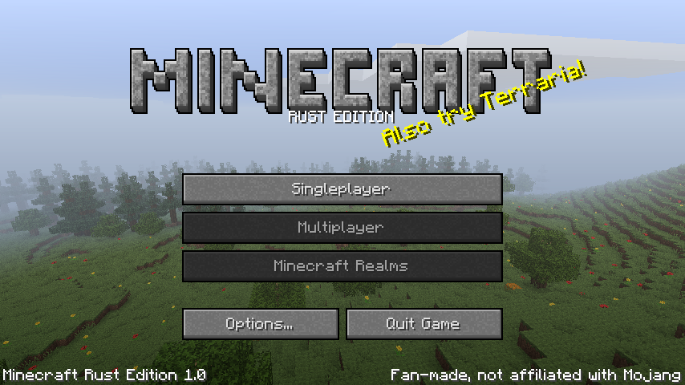

## Original prompt

This whole codebase was generated by Claude Code from this single opening prompt:

> Your goal is to make a working base version of Minecraft using Rust with no dependencies.
> The done state is a working script that I can call from the command line that will start
> the game on my computer and allow me to play it. I want you to create all the assets
> yourself. You may use sub-agents wherever you feel necessary. Remember, it is a pixel art
> game and needs to have pixel art assets. I want the game to be a base version which
> includes moving around, jumping up and down, terrain generation including all the basic
> biomes that you would expect, the ability to cause blocks to be broken and collected, the
> ability to craft basic tools and basic items, and the use of those tools on the
> environment. There should also be the basics such as wheat, as well as torches and some
> basic mobs as well. Try and be as accurate as you can to the original game's pixel art.
> Also try to be very accurate in terms of the user interface elements on the page and the
> start menu. As I said, this needs to be completely made from rust and have zero
> dependencies.

## Screenshots

### World

| | |
| --- | --- |
| 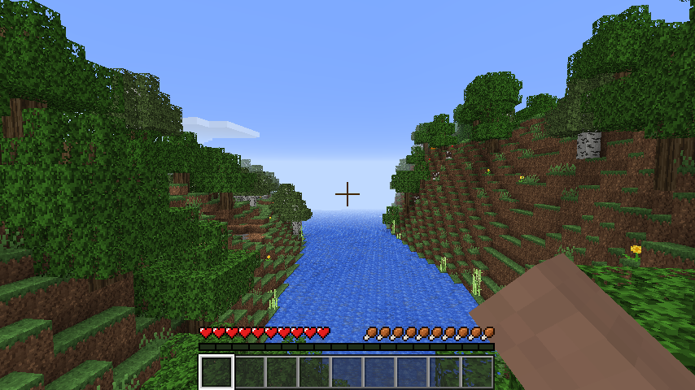 Forest and river | 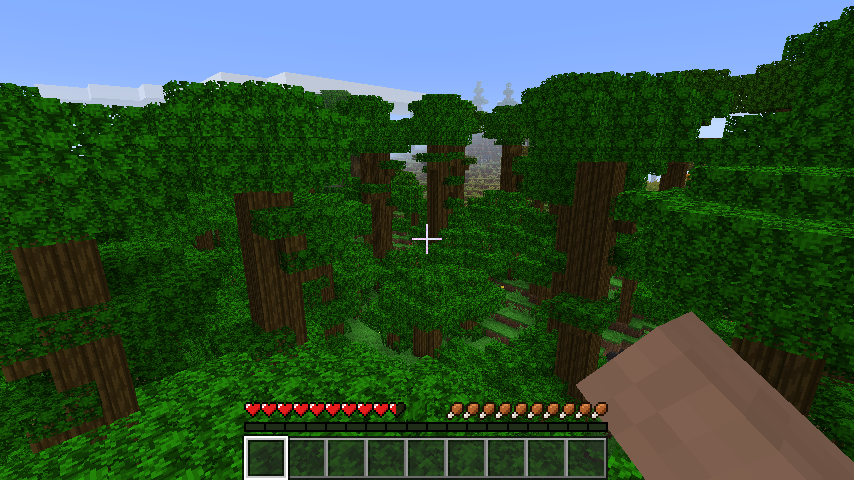 Jungle |
| 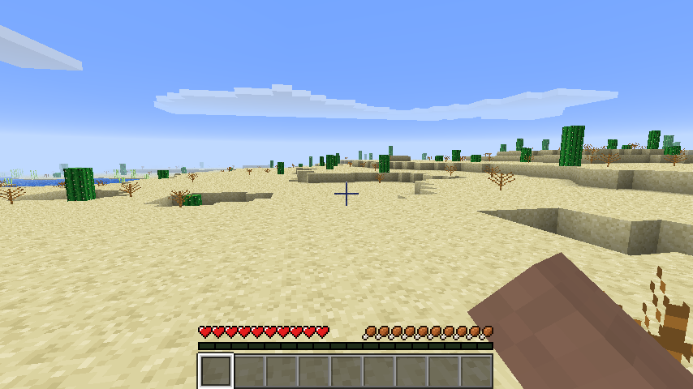 Desert | 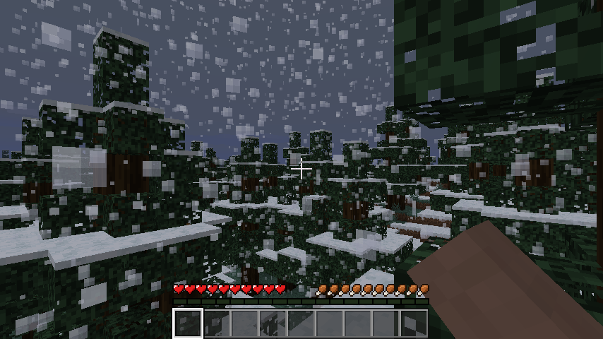 Snowy taiga in a snowstorm |
| 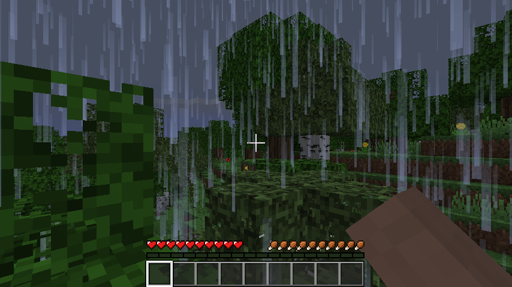 Rain | 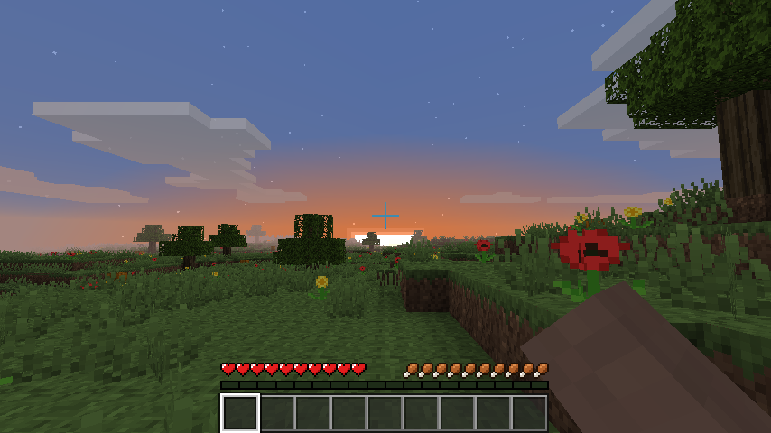 Sunset |
| 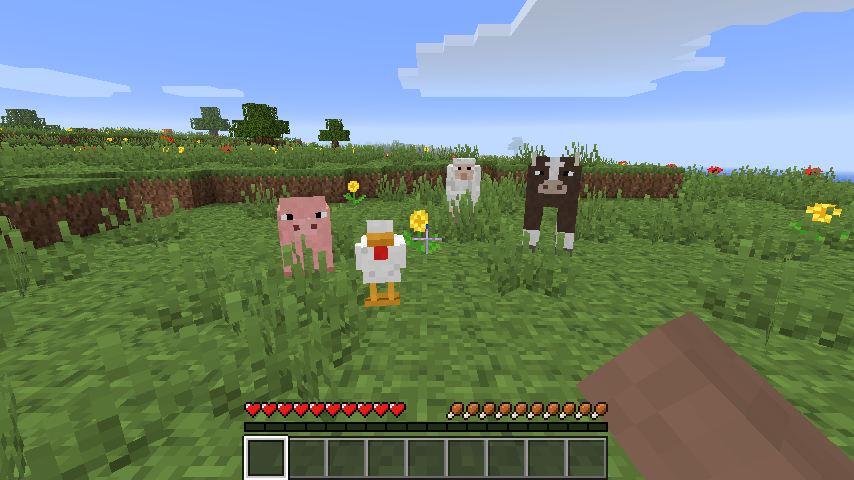 Pig, chicken, sheep and cow | 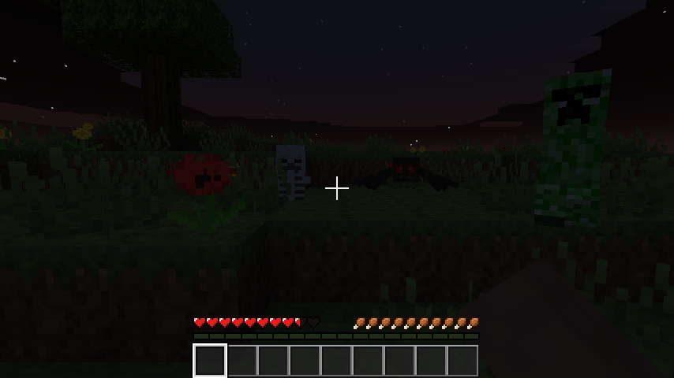 Skeleton, spider and creeper at night |
| 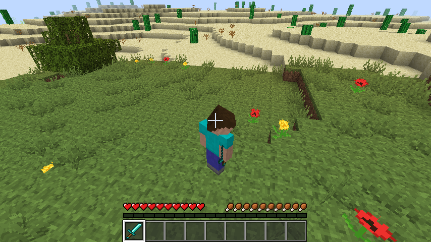 Third-person view (F5) | 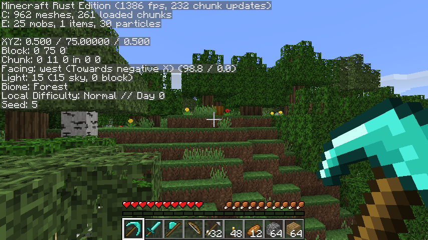 Debug screen (F3) |

### Interface

| | |
| --- | --- |
| 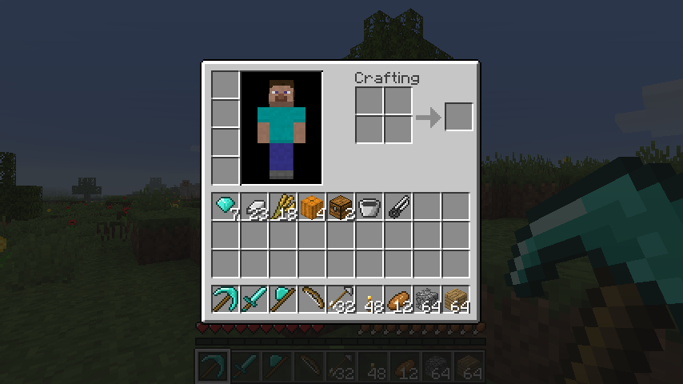 Inventory | 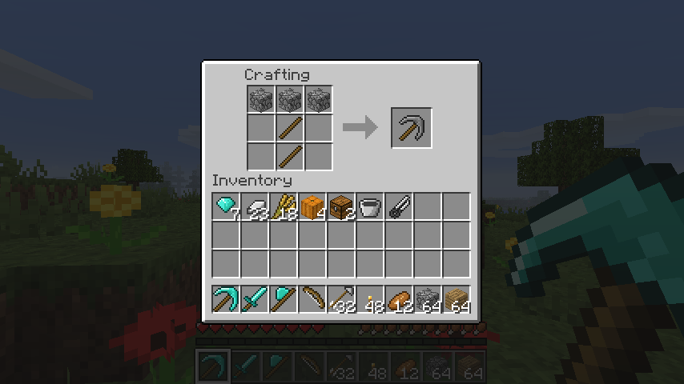 Crafting table |
| 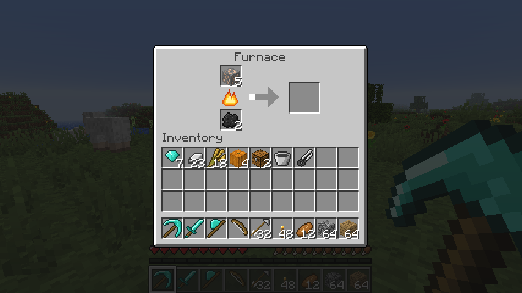 Furnace | 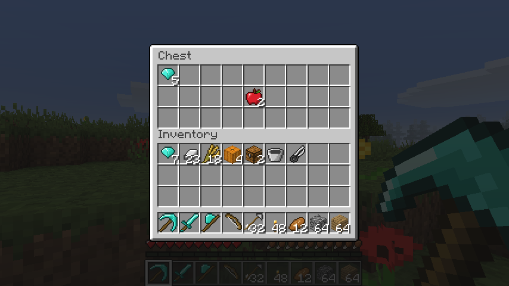 Chest |
| 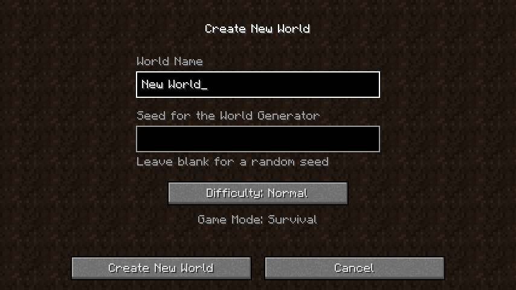 Create New World | 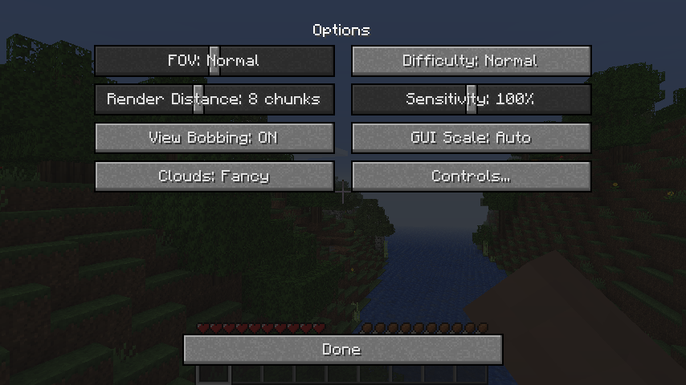 Options |
| 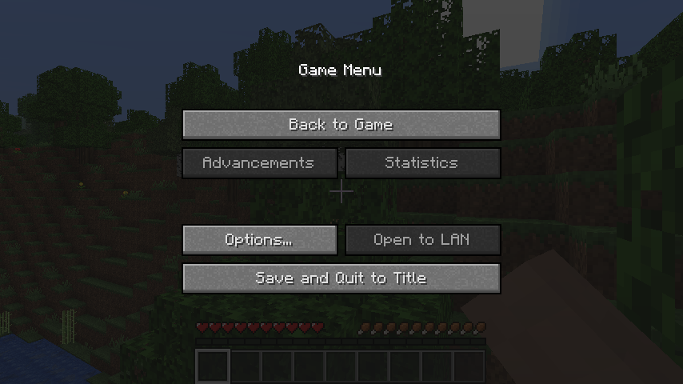 Game Menu | 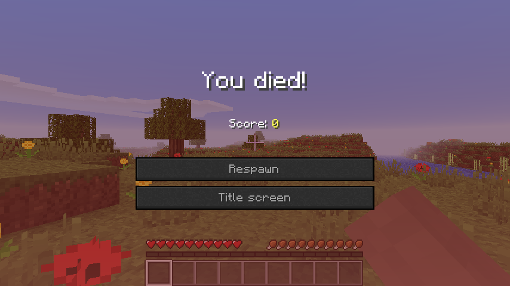 Death screen |

### Generated pixel art

Every texture below is drawn by code at startup (`./play.sh --dump-assets DIR` exports them).

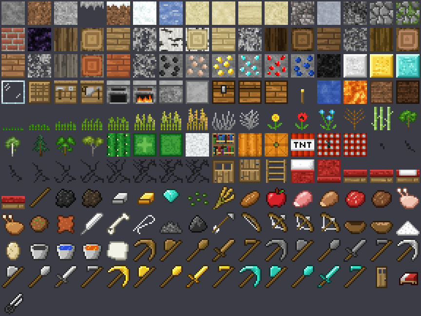

## Running

```sh
./play.sh
```

This builds an optimized binary and starts the game. It needs macOS and a Rust toolchain
(`cargo`). The first build takes about 30 seconds.

Command-line extras:

- `./play.sh --dump-assets DIR` writes every generated texture to `DIR` as PNG, plus a
  contact sheet.
- `./play.sh --map SEED out.png` renders a top-down biome map.

## Features

- **Terrain generation** with smooth biome blending. Biomes: plains, forest, birch forest,
  taiga, snowy taiga, snowy tundra, desert, savanna, jungle, swamp, mountains, snowy
  mountains, beaches, rivers, oceans, deep oceans and frozen oceans. The world also has
  caves and caverns, lava lakes deep underground, and ores at vanilla-like depths: coal,
  iron, gold, redstone, lapis and diamond.
- **Trees and plants:** oak, big oak, birch, spruce, jungle (including 2x2 giants and
  bushes) and acacia trees. Tall grass, ferns, flowers, cacti, dead bushes, sugar cane and
  pumpkins.
- **Rendering:**
  - Smooth lighting with ambient occlusion, sky light and block light (torches, lava,
    lit furnaces).
  - Day/night cycle with sun, moon, stars and sunrise/sunset colours.
  - 3D clouds and biome-tinted grass and leaves.
  - Weather: rain, and snow in cold biomes, which darkens the sky and has its own sound.
  - Translucent water that flows and slopes.
- **Survival:**
  - Health, hunger and saturation, plus fall, drowning, lava and cactus damage.
  - Breaking blocks takes time depending on the tool, with crack animation and particles.
  - Harvest levels (e.g. iron ore needs a stone pickaxe) and tool durability.
- **Crafting:** 2x2 in the inventory and 3x3 at the crafting table. Recipes include planks,
  sticks, torches, crafting table, furnace, chest, all 25 tools (wood, stone, iron, gold,
  diamond), shears, doors, ladders, fences, beds, bread, bucket, bow, arrows, sandstone, storage blocks, bookshelf, TNT and more.
  Shift-click to craft in bulk.
- **Building basics:** doors (open them with right-click), ladders you can climb, fences
  that connect to each other, and beds. Sleeping in a bed at night skips to morning and sets
  your respawn point.
- **Furnace smelting** with fuel (ores, sand to glass, cobblestone to stone, cooking meat,
  logs to charcoal…). **Chests** store items.
- **Farming:** till grass with a hoe, plant seeds (from breaking grass), and watch wheat grow
  through 8 stages. Farmland near water is moist and grows crops faster. Bake bread from
  wheat.
- **Saplings** drop from leaves and grow into trees. Grass spreads, leaves decay, sugar cane
  and cacti grow.
- **Mobs:** pigs, cows, sheep (shear them for wool; it regrows when they graze) and
  chickens (which lay eggs), plus zombies (which burn in
  daylight), skeletons (which shoot arrows), creepers (which explode) and spiders (which
  climb walls). They spawn in the dark and drop items when killed.
- **Combat:** swords, critical hits, knockback, and bows you can draw and fire.
- **Fluids:** buckets pick up and place water or lava. Lava meets water to make obsidian or
  cobblestone.
- **UI** modelled on vanilla:
  - Screens: title screen with live panorama and splash text, Select World, Create New
    World, Options (sliders), Controls, Game Menu and the death screen.
  - In-game: inventory with player preview, the crafting table/furnace/chest windows,
    hotbar, hearts, hunger, air bubbles and the F3 debug screen.
- **Saving:** worlds are saved to `~/.mcrust/saves/` (autosaved every 5 minutes, and on
  quit).

## Controls

| Action | Key |
| --- | --- |
| Move | W A S D |
| Jump / swim up | Space |
| Sneak | Left Shift |
| Sprint | Control or Option (or double-tap W) |
| Attack / break | Left mouse (hold) |
| Use / place / eat / draw bow | Right mouse |
| Inventory | E |
| Drop item | Q |
| Hotbar | 1–9 or scroll wheel |
| Hide HUD / debug / camera view | F1 / F3 / F5 |
| Screenshot (saved to `~/.mcrust/screenshots`) | F2 |
| Fullscreen | F11 |
| Pause | Esc |

In inventories, left-click picks up or places a stack, and right-click picks up half or
places one. Shift-click moves a stack quickly, and pressing 1–9 swaps the hovered slot with
that hotbar slot.

## Code layout

| File | Purpose |
| --- | --- |
| `platform.rs` | Cocoa window, OpenGL context, input (Objective-C runtime FFI) |
| `gl.rs` | OpenGL bindings, shaders, textures, buffers |
| `audio.rs` | AudioQueue output, mixer, synthesized sounds and music |
| `world.rs`, `worldgen.rs` | Chunks, light propagation, terrain/biome generation |
| `mesher.rs`, `render.rs` | Chunk meshing (AO and smooth lighting), sky, clouds |
| `game.rs`, `physics.rs`, `entity.rs` | Simulation, player, mobs, items, fluids |
| `draw.rs`, `ui.rs`, `screens.rs` | 3D scene, HUD, menus and GUIs |
| `models.rs` | Vanilla-layout box models for mobs and the player |
| `assets/*` | Procedural pixel art (blocks, items, mobs, GUI, font, logo) |
| `save.rs` | World save format |

This is a fan-made project and is not affiliated with Mojang or Microsoft.
